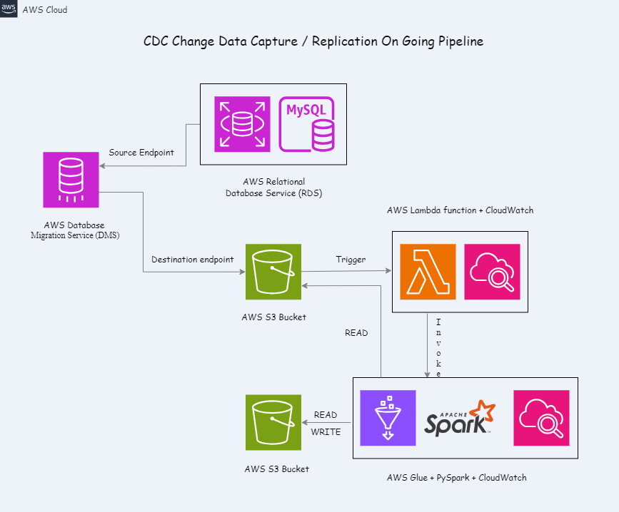

# Change Data Capture (CDC) / Replication On Going pipeline

## Requirement

The end goal of this project is to have a fully functional CDC pipeline.
The pipeline will cover two phases:
1. Full Load to replicate the initial database
2. CDC / Replication on Going to process database changes

Initially, it will extract the full load - all data present inside the database - and load it in a temporary HDFS / AWS S3 bucket storage.
Then, it will keep on looking for any changes made inside the source database and compensate that changes inside the destination storage. 
The main essence is that it will create a data lake out of this database and any future changes in the database (insertion, deletion, updating, etc.).

## Architecture

As you can see in the architecture, there are a few things we need to set up the cloud infrastructure to run this project.

1. RDS MySQL database instance for Source Endpoint
2. Temporary S3 Bucket for temporary Destination / target Endpoint
3. DMS setup with two endpoints attached: a source endpoint and a destination endpoint
    DMS reads data from Source Endpoint RDS MySQL database instance
    DMS writes data to the Destination Endpoint - Temp S3 bucket
4. Lambda function with a configured trigger which will be invoked when a new data file lands in the Temp S3 bucket
5. Glue PySpark job triggered by the Lambda function to process / transform the data and load / write it in the final destination S3 Bucket
